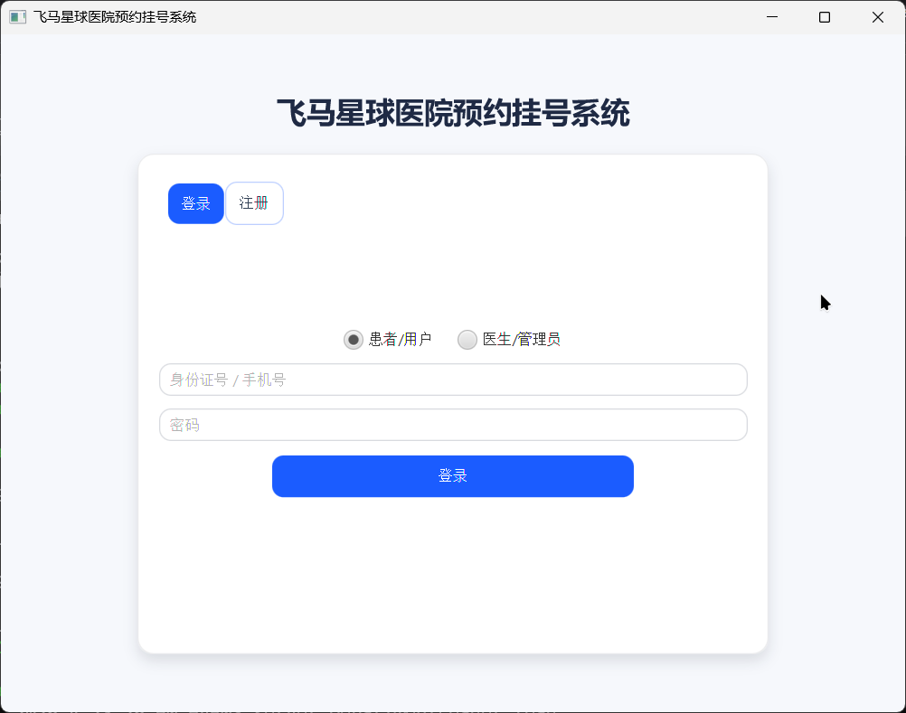
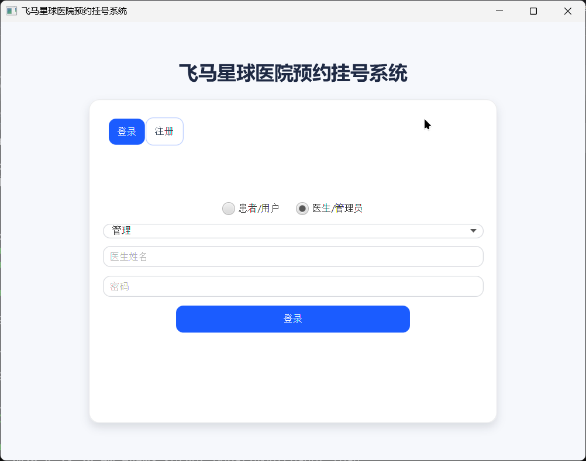
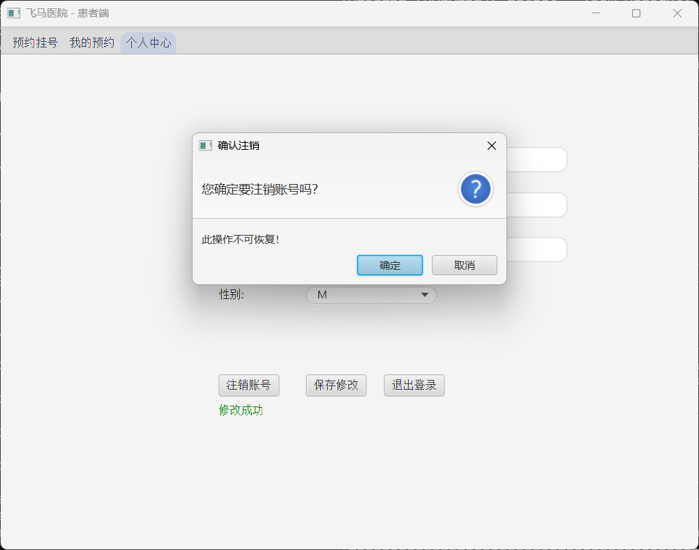
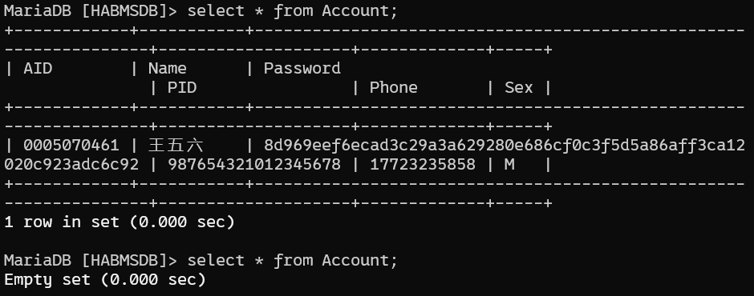
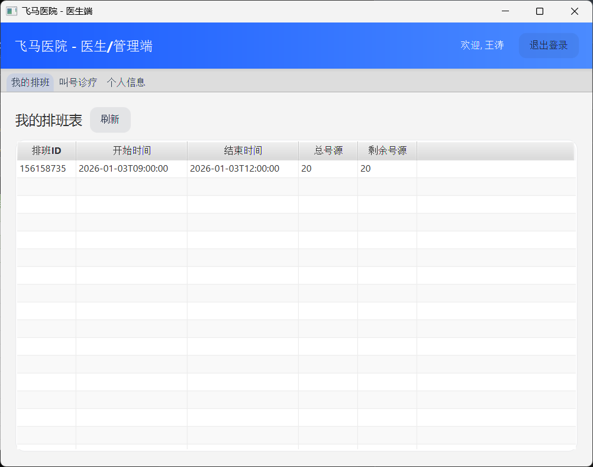
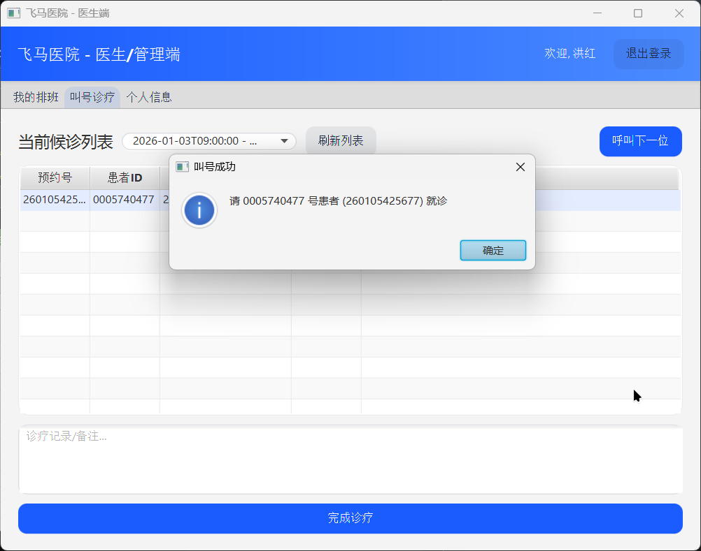

# 飞马星球医院预约挂号微系统报告

## 1. 项目概览

基本信息

| 项目     | 信息            |
| ------ | ------------- |
| 模式     | C/S           |
| 数据库    | MySQL/MariaDB |
| 依赖管理   | Maven         |
| Java版本 | Java17+       |
项目结构：

```text
+--------+     +--------+
| server | <-> |   db   |       :server 服务端
+--------+     +--------+
    ^
    | JSON / TCP
    v
+--------+
| client |                      :client 客户端
+--------+
```

其中，数据库可以和服务端在同一计算机上，也可以在网络中，修改`HABMS_URL`环境变量即可配置。

## 2. 运行

+ 安装数据库（MariaDB）
+ 初始化数据库：`HABMS\server\src\main\resources\init_habms.sql`脚本初始化数据库和 java 用户
+ 使用maven拉取依赖：项目根目录运行命令`./mvnw clean package`（需要网络连接）
+ 将`SERVER_HOST`和`SERVER_PORT`环境变量改为自己的服务器地址和端口。
+ 如需要，修改`HABMS_PORT`、`HABMS_URL`、`HABMS_USER`、`HABMS_PASS`环境变量配置数据库连接。
+ 启动server：`cd server;./mvnw clean compile exec:java -Dexec.mainClass=HABMS.server.ServerMain`
+ 启动client：`cd client;./mvnw clean javafx:run`

可以把源代码拷贝两份分别运行客户端和服务端，也可以在`server`目录和`client`目录分别使用`./mvnw clean package`将客户端和服务端分别打包为jar，使用jar运行。

打包后客户端为`client\target\habms-client-0.1.0-SNAPSHOT.jar`（默认 Windows 平台，如需 mac/linux 切换 -Djavafx.platform=mac|linux），服务端为`server\target\habms-server-0.1.0-SNAPSHOT-fat.jar`

## 3. 功能实现与要求对应

+ 患者注册/登录/注销：前端验证年龄，账号信息校验，密码最少 4 位；注销会清理账户。
+ 科室查询：从 `HABMS\server\src\main\resources\department.json` 加载，客户端展示下拉选择。
+ 医生查询：按科室过滤，展示医生专长、排班。
+ 预约挂号：选择医生与可预约时间段创建预约；同一时间段单人仅一号源，服务端事务扣减。
+ 取消预约：仅在可取消状态下回补号源。
+ 信息修改：患者可改除 ID/身份证号外的个人信息。
+ 医生管理与排班：管理员导入、添加、更新、删除医生与排班。
+ 批量导入：管理员可从 xls/csv 导入医生与排班（客户端工具入口）。
+ 导出与报告：支持导出预约记录（xls）；月度统计报告生成 pdf。
+ 并发控制：预约流程数据库事务与同步锁，避免重复占号。

## 4. 系统架构与模块

+ client 模块
  + `App`：JavaFX 启动/舞台管理。
  + `Session`：登录态持有（区分患者/医生）。
  + `controller`：登录、患者主页、医生主页、管理员页。
  + `net/NetworkClient`：TCP 长连接，行分隔 JSON。
  + `service`：AuthService（认证）、LookupService（查询）。
  + `model`：User/Doctor/Schedule/Appointment/Request/Response DTO（客户端数据对象）。
  + `resources`：FXML 视图与 CSS（JavaFX的资源）。
+ server 模块
+ `server`包
  + `ServerMain`：初始化：读取端口/DB 环境变量后启动。
  + `DepartmentLoader`：加载科室列表（由`ServerMain`调用）。
  + `ServerRuntime`：服务器主循环，监听 `ServerSocket` 接入。
  + `Service`：多线程模块，处理每一个TCP连接的数据传输和操作，按 type 路由业务处理。
+ `db`包
  + `HABMSDB`：处理数据库操作，抽象业务方法提供给上层调用
  + 数据实体/枚举：`Account`、`DoctorAccount`、`Schedule`、`Appointment`、`AppointmentStatus`、`Sex`、`IdGenerator`，数据库内数据对象在java中的对应数据对象。
  + `resources`：`department.json`、`init_habms.sql`，数据文件和初始化脚本。

接口描述：

+ 数据对象和数据库操作接口见`server\数据对象与数据库接口.md`
+ 服务端网络接口见`server\NETWORK_API.md`
+ 客户端顶层设计见`Client设计.md`

## 5. 核心技术点

+ 数据库操作：
  + 基于JDBC连接数据库以及进行SQL语句执行
  + 并发安全：基于手动事务模式将关键操作转变为原子操作，以达到并发一致性
+ 网络连接：
  + 多线程：服务器对每一个TCP连接使用一个线程专门负责交互
  + 线程池：使用线程池优化多线程能力
+ 文件导入导出：
  + 前端负责将文件和JSON数据互换，后端只接收/发送JSON数据，减小服务器压力
+ UI：`JavaFX` + `FXML` + `CSS`，后台任务用 `javafx.concurrent.Task`，UI 更新用 `Platform.runLater`，保证UI构建模块化且后台任务不会卡住UI。
+ 序列化/反序列化：`Jackson` + `JavaTimeModule`实现对象和JSON的转换。
+ 配置：使用`System.getenv`支持通过环境变量覆盖默认配置。可配置的环境变量有：
  + `HABMS_PORT`：服务器监听端口（默认`9000`）
  + `HABMS_URL`：数据库URL（默认`jdbc:mariadb://localhost:3306/HABMSDB`）
  + `HABMS_USER`：数据库用户（默认`rjava`）
  + `HABMS_PASS`：数据库用户密码（默认`rjava`）
  + `HABMS_DEPARTMENTS`：部门信息配置文件（默认`department.json`）
  + `SERVER_HOST`：（客户端）服务器主机位置（默认`localhost`）
  + `SERVER_PORT`：（客户端）服务器端口（默认`9000`）
+ 日志：`java.util.logging`。

## 6. 并发与安全

+ 并发：服务端多线程，每连接一线程；预约使用 DB 锁+事务；排班更新需与预约一致性检查。
+ 安全：密码 SHA-256 传输

## 7. 附加数据

本项目附带了一些测试用文件，主要是测试`xls`导入的，在`datas`目录下。

## 8. 测试与截图

数据库初始化、配置好环境变量后

### 1. 登录页面

用户登录页面：

医生登录页面：

注册页面：

注册年龄限制：

年龄判断，小于10岁的不能注册

### 2. 管理员页面与功能

在登录页面选择部门"管理"，使用内置管理员账户登录（用户名：Admin，密码：admin）。

管理员页面：

#### 导入医生列表新建医生账户

点击导入医生列表可以导入医生列表

data/doctor.xlsx：

由于配置中没有写“中医科”，所以报错：

修改后可以正常导入，点击“刷新医生列表”可以看到导入的医生：

#### 导入排班表

点击导入排班表可以导入排班表

data/schedule.xlsx：

导入后点击“刷新排班列表”可以看到导入的排班：

#### 导出

点击“刷新预约数据”从后端索引预约数据。

可以导出预约记录（xls格式）：

可以导出月度统计报表（pdf格式）：

选择月份:

报表样式：

### 3. 用户页面与功能

#### 预约相关操作

登陆后，点击科室可以查看当前科室医生，点击医生可以查看医生的排班表。

点击排班后再点击“确认预约”可以预约此时间段

在“我的预约页面”可以查看所有预约记录，也可以取消预约（先点击对应预约记录）

取消预约会返还排班的容量

#### 账户相关操作

在“个人中心”页面可以查看个人信息，并且可以修改

数据库可见修改前后

由于需要使用PID或者手机号登录，所以这两个是不能更改的。

也可以注销账户

注销后数据库对应记录会删除

### 4.医生页面与功能

登录后可以看到排班

可以看到当前待就诊列表

可以叫号（将下一个预约的statu从ok改变为done）

如图，叫号后数据库的状态（ok变为了done）
